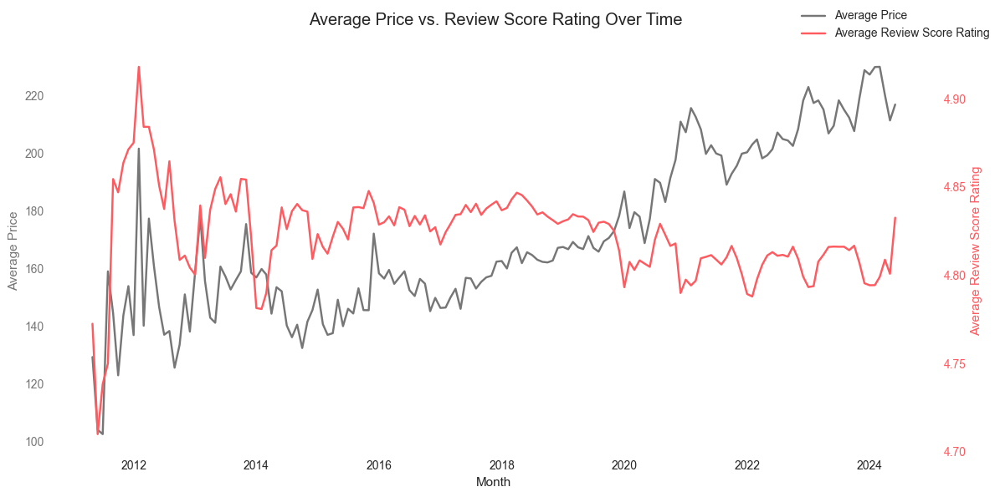
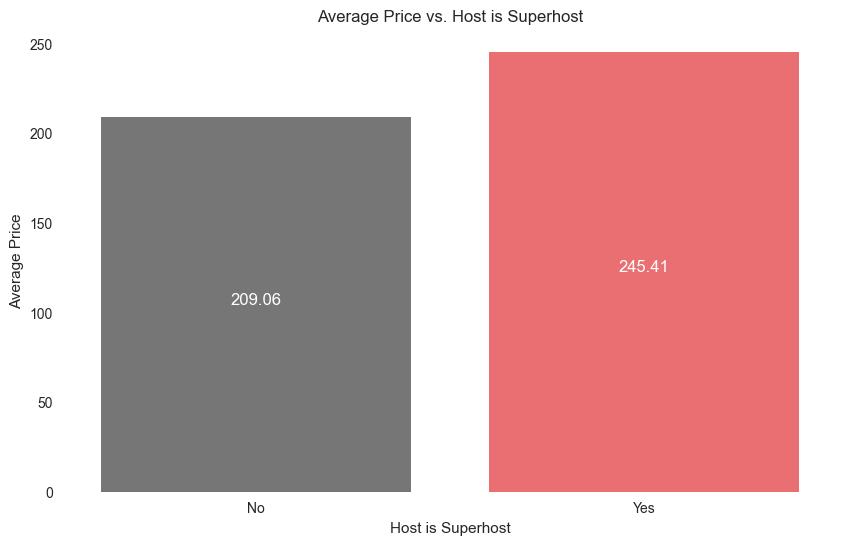
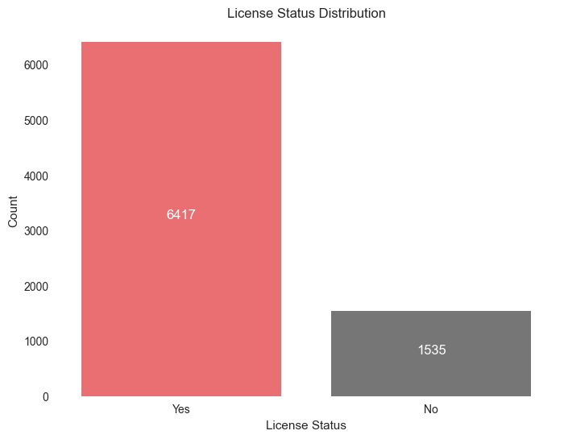
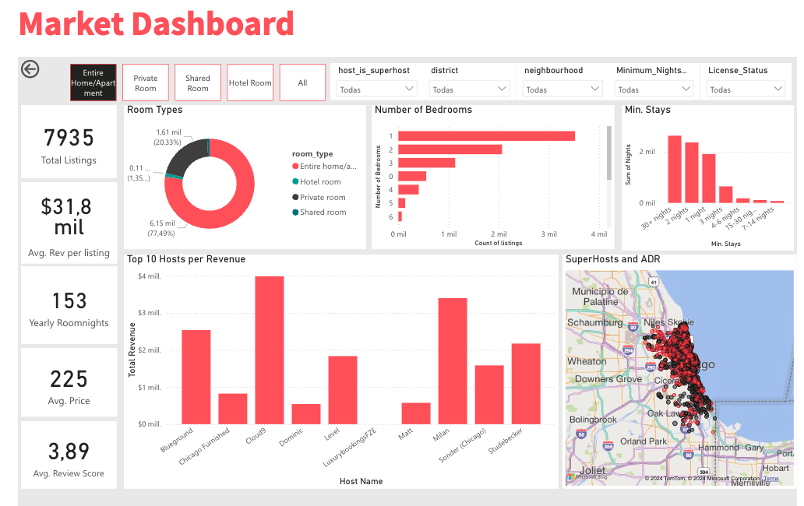

# Chicago Airbnb Data Analysis

## Author
Rosalía González Caviedes
- [Email](rosaliagonzalezc@gmail.com)
- [Linkedin profile](https://www.linkedin.com/in/rosaliagonzalezcaviedes/)

## Project Date
October 2024

## Project Overview
This project analyzes Airbnb listings in Chicago to uncover trends and insights within the market.

The objective is to explore pricing, factors, neighborhood characteristics, licenses and other factors to review patterns that impact property and Airbnb performance.

The analysis includes data preprocessing, exploratory data analysis (EDA), and visualizations to help identify significant patterns and provide value to hosts and guests alike.

This project has also been deployed as an interactive web app using Streamlit. You can check it out [here](https://airbnbchicagoliagcaviedes.streamlit.app/)

## Table of Contents
- [Project Overview](#project-overview)
- [Data](#data)
- [Methodology](#methodology)
- [Exploratory Data Analysis](#exploratory-data-analysis)
- [Data Preprocessing and Feature Engineering](#data-preprocessing-and-feature-engineering)
- [Application](#application)
- [Results and Insights](#results-and-insights)
- [How to Use](#how-to-use)
- [Future Work](#future-work)

## Data
The project utilizes Airbnb data, including information on:
- Listings
- Neighborhood attributes
- Reviews and ratings
- [Go to data from Inside AirBnb](https://insideairbnb.com/)

Data cleaning, imputation, and feature engineering steps were taken to handle missing values, improve data quality, and optimize the data for analysis.

## Methodology
- **Data Cleaning:** Removal of duplicates, imputation of missing values, and transformations (e.g., logarithmic transformation on price).
- **Exploratory Data Analysis (EDA):** Visual exploration of neighborhood distribution, review trends, price distributions, and superhost comparisons.
- **Feature Engineering:** Creation of variables such as district, amenities encoding, and review scores.
- **Application Development:** A Streamlit app showcases the data insights in an interactive format.

## Exploratory Data Analysis
Key findings and visualizations include:
- **Price distribution across neighborhoods**
- **Superhost analysis:** Comparison of prices and review scores for superhosts vs. regular hosts.
- **Temporal trends in reviews and price changes over time**

## Data Preprocessing and Feature Engineering
Steps included:
- **Merging Datasets:** Listings, reviews, and neighborhood data were combined.
- **Handling Missing Values:** Imputation strategies were applied to columns such as price, review_scores_rating, and amenities.
- **Encoding:** One-hot encoding was applied to categorical features such as district and room_type.
- **New Features:** Engineered features such as estimated_nights_booked and total_income were added for enhanced analysis.

Example visualization of data preprocessing results:









## Application
The Streamlit app includes:
- **Interactive Visualizations:** Graphs showing neighborhood trends, average prices, and review scores.


## Power BI Dashboard
- **Interactive Visualizations:**  Interactive dashboard to work on the study conclusions.
- **Data Filtering:** The ability to explore specific groups of listings based of multiple filtering options.
- **Total Income and Roomnighs:** Estimation based on minimum stays, reviews and price.

Power BI Dashboard:




## Results and Insights
### Key Insights
- Properties in central and northern districts of Chicago tend to have higher prices.
- Superhosts generally charge more per night and receive higher review scores.
- Review activity peaked around 2020, with a slight decline in recent years.

## How to Use
Clone this repository:
```bash
git clone https://github.com/your-repo/Airbnb-Chicago-Data-Analysis.git
cd Airbnb-Chicago-Data-Analysis
```


Run the Streamlit App:
```bash
streamlit run app.py
```

The app will open in your default browser, where you can interact with the data and view insights.

## Future Work
Planned improvements:
- Enhancing Streamlit app to support additional user interactions.
- Expanded Feature Engineering: Adding external data, such as local attractions and crime rates.
- Predictive Analysis: Reintegrating a predictive model for price forecasting after error resolution.

## References
- Inside Airbnb
- NBER. National Bureau of Economic Research
- AirDNA
- World Business Chicago
- Enjoy Illinois. Economic Impact of Visitors in Illinois
- Crain's Chicago Business
